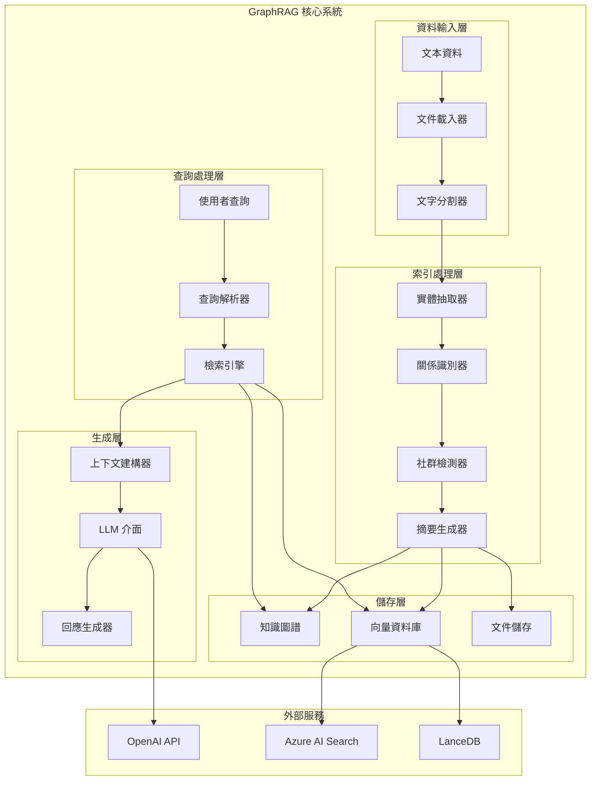
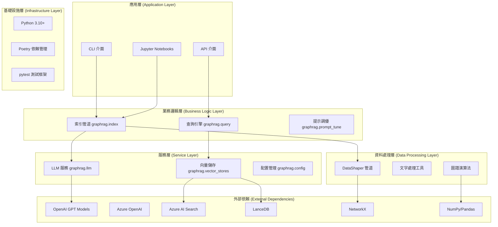
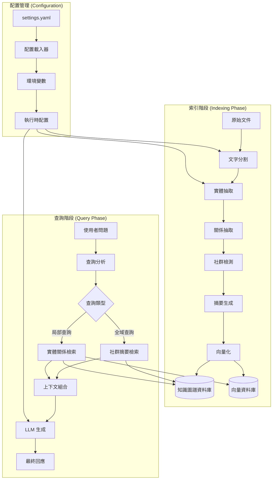
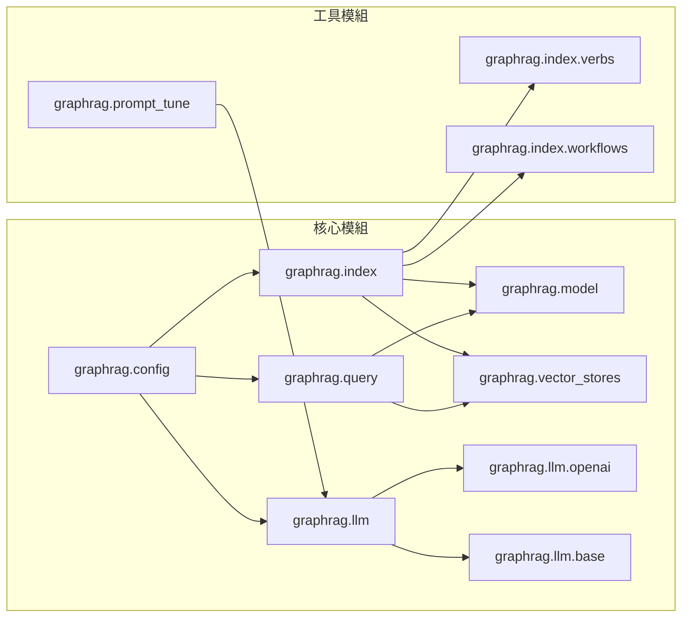
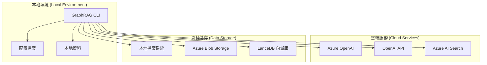

# GraphRAG 架構圖表

## 1. 實體架構圖 (Entity Architecture)

```mermaid
graph TB
    subgraph "GraphRAG 核心系統"
        subgraph "資料輸入層"
            A[文本資料] --> B[文件載入器]
            B --> C[文字分割器]
        end
        
        subgraph "索引處理層"
            C --> D[實體抽取器]
            D --> E[關係識別器]
            E --> F[社群檢測器]
            F --> G[摘要生成器]
        end
        
        subgraph "儲存層"
            G --> H[知識圖譜]
            G --> I[向量資料庫]
            G --> J[文件儲存]
        end
        
        subgraph "查詢處理層"
            K[使用者查詢] --> L[查詢解析器]
            L --> M[檢索引擎]
            M --> H
            M --> I
        end
        
        subgraph "生成層"
            M --> N[上下文建構器]
            N --> O[LLM 介面]
            O --> P[回應生成器]
        end
    end
    
    subgraph "外部服務"
        Q[OpenAI API]
        R[Azure AI Search]
        S[LanceDB]
    end
    
    O --> Q
    I --> R
    I --> S
```

## 2. 技術棧架構圖 (Technology Stack)

```mermaid
graph TB
    subgraph "應用層 (Application Layer)"
        A1[CLI 介面]
        A2[API 介面]
        A3[Jupyter Notebooks]
    end
    
    subgraph "業務邏輯層 (Business Logic Layer)"
        B1[索引管道 graphrag.index]
        B2[查詢引擎 graphrag.query]
        B3[提示調優 graphrag.prompt_tune]
    end
    
    subgraph "服務層 (Service Layer)"
        C1[LLM 服務 graphrag.llm]
        C2[向量儲存 graphrag.vector_stores]
        C3[配置管理 graphrag.config]
    end
    
    subgraph "資料處理層 (Data Processing Layer)"
        D1[DataShaper 管道]
        D2[文字處理工具]
        D3[圖譜演算法]
    end
    
    subgraph "基礎設施層 (Infrastructure Layer)"
        E1[Python 3.10+]
        E2[Poetry 依賴管理]
        E3[pytest 測試框架]
    end
    
    subgraph "外部依賴 (External Dependencies)"
        F1[OpenAI GPT Models]
        F2[Azure OpenAI]
        F3[Azure AI Search]
        F4[LanceDB]
        F5[NetworkX]
        F6[NumPy/Pandas]
    end
    
    A1 --> B1
    A2 --> B2
    A3 --> B1
    B1 --> C1
    B2 --> C2
    B1 --> D1
    C1 --> F1
    C2 --> F3
    C2 --> F4
    D1 --> F5
    D3 --> F6
```

## 3. 資料流程圖 (Data Flow Diagram)

```mermaid
flowchart TD
    subgraph "索引階段 (Indexing Phase)"
        A[原始文件] --> B[文字分割]
        B --> C[實體抽取]
        C --> D[關係抽取]
        D --> E[社群檢測]
        E --> F[摘要生成]
        F --> G[向量化]
        G --> H[(知識圖譜資料庫)]
        G --> I[(向量資料庫)]
    end
    
    subgraph "查詢階段 (Query Phase)"
        J[使用者問題] --> K[查詢分析]
        K --> L{查詢類型}
        
        L -->|全域查詢| M[社群摘要檢索]
        L -->|局部查詢| N[實體關係檢索]
        
        M --> H
        N --> H
        N --> I
        
        M --> O[上下文組合]
        N --> O
        
        O --> P[LLM 生成]
        P --> Q[最終回應]
    end
    
    subgraph "配置管理 (Configuration)"
        R[settings.yaml] --> S[配置載入器]
        S --> T[環境變數]
        T --> U[執行時配置]
    end
    
    U --> B
    U --> C
    U --> P
```

## 4. 模組依賴圖 (Module Dependencies)

```mermaid
graph LR
    subgraph "核心模組"
        A[graphrag.config] --> B[graphrag.index]
        A --> C[graphrag.query]
        A --> D[graphrag.llm]
        
        B --> E[graphrag.model]
        C --> E
        
        B --> F[graphrag.vector_stores]
        C --> F
        
        D --> G[graphrag.llm.openai]
        D --> H[graphrag.llm.base]
    end
    
    subgraph "工具模組"
        I[graphrag.prompt_tune]
        J[graphrag.index.verbs]
        K[graphrag.index.workflows]
    end
    
    B --> J
    B --> K
    I --> D
```

## 5. 部署架構圖 (Deployment Architecture)

```mermaid
graph TB
    subgraph "本地環境 (Local Environment)"
        A[GraphRAG CLI]
        B[配置檔案]
        C[本地資料]
    end
    
    subgraph "雲端服務 (Cloud Services)"
        D[Azure OpenAI]
        E[OpenAI API]
        F[Azure AI Search]
    end
    
    subgraph "資料儲存 (Data Storage)"
        G[本地檔案系統]
        H[Azure Blob Storage]
        I[LanceDB 向量庫]
    end
    
    A --> B
    A --> C
    A --> D
    A --> E
    A --> F
    A --> G
    A --> H
    A --> I
```
