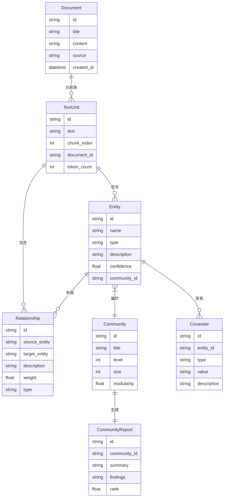
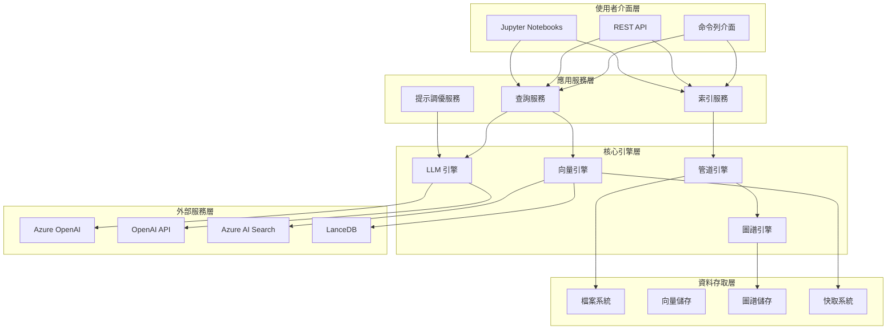
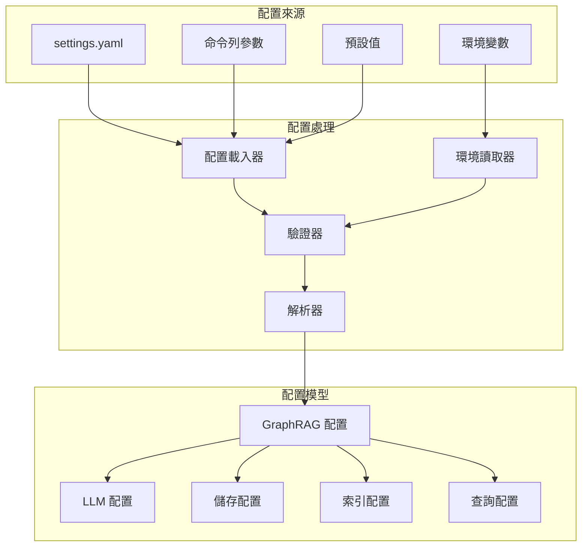
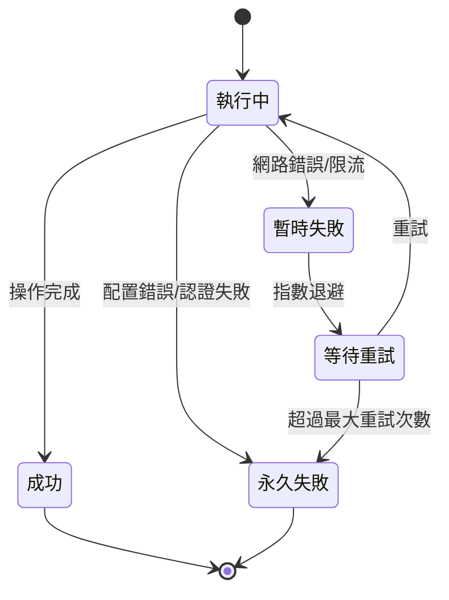

# GraphRAG 實體關係圖

## 核心實體與關係模型

```mermaid
erDiagram
    Document ||--o{ TextUnit : "分割為"
    TextUnit ||--o{ Entity : "包含"
    TextUnit ||--o{ Relationship : "包含"
    Entity ||--o{ Relationship : "參與"
    Entity }|--|| Community : "屬於"
    Community ||--|| CommunityReport : "生成"
    Entity ||--o{ Covariate : "具有"
    
    Document {
        string id
        string title
        string content
        string source
        datetime created_at
    }
    
    TextUnit {
        string id
        string text
        int chunk_index
        string document_id
        int token_count
    }
    
    Entity {
        string id
        string name
        string type
        string description
        float confidence
        string community_id
    }
    
    Relationship {
        string id
        string source_entity
        string target_entity
        string description
        float weight
        string type
    }
    
    Community {
        string id
        string title
        int level
        int size
        float modularity
    }
    
    CommunityReport {
        string id
        string community_id
        string summary
        string findings
        float rank
    }
    
    Covariate {
        string id
        string entity_id
        string type
        string value
        string description
    }
```

## 系統組件關係圖

```mermaid
graph TB
    subgraph "使用者介面層"
        CLI[命令列介面]
        API[REST API]
        NB[Jupyter Notebooks]
    end
    
    subgraph "應用服務層"
        IDX[索引服務]
        QRY[查詢服務]
        PT[提示調優服務]
    end
    
    subgraph "核心引擎層"
        PE[管道引擎]
        LLM[LLM 引擎]
        VE[向量引擎]
        GE[圖譜引擎]
    end
    
    subgraph "資料存取層"
        FS[檔案系統]
        VS[向量儲存]
        GS[圖譜儲存]
        CS[快取系統]
    end
    
    subgraph "外部服務層"
        AOAI[Azure OpenAI]
        OAI[OpenAI API]
        AIS[Azure AI Search]
        LDB[LanceDB]
    end
    
    CLI --> IDX
    CLI --> QRY
    API --> IDX
    API --> QRY
    NB --> IDX
    NB --> QRY
    
    IDX --> PE
    QRY --> LLM
    QRY --> VE
    PT --> LLM
    
    PE --> GE
    LLM --> AOAI
    LLM --> OAI
    VE --> AIS
    VE --> LDB
    
    GE --> GS
    PE --> FS
    VE --> CS
```

## 資料處理管道圖

```mermaid
flowchart LR
    subgraph "輸入處理"
        A[原始文件] --> B[文件載入器]
        B --> C[文字清理器]
        C --> D[文字分割器]
    end
    
    subgraph "實體處理"
        D --> E[實體抽取器]
        E --> F[實體解析器]
        F --> G[實體合併器]
    end
    
    subgraph "關係處理"
        G --> H[關係抽取器]
        H --> I[關係驗證器]
        I --> J[關係權重計算器]
    end
    
    subgraph "圖譜建構"
        J --> K[圖譜建構器]
        K --> L[社群檢測器]
        L --> M[層次分析器]
    end
    
    subgraph "摘要生成"
        M --> N[社群摘要器]
        N --> O[報告生成器]
        O --> P[品質評估器]
    end
    
    subgraph "向量化"
        P --> Q[文字向量化器]
        Q --> R[圖譜嵌入器]
        R --> S[索引建構器]
    end
```

## 配置管理架構

```mermaid
graph TD
    subgraph "配置來源"
        A[settings.yaml]
        B[環境變數]
        C[命令列參數]
        D[預設值]
    end
    
    subgraph "配置處理"
        E[配置載入器]
        F[環境讀取器]
        G[驗證器]
        H[解析器]
    end
    
    subgraph "配置模型"
        I[GraphRAG 配置]
        J[LLM 配置]
        K[儲存配置]
        L[索引配置]
        M[查詢配置]
    end
    
    A --> E
    B --> F
    C --> E
    D --> E
    
    E --> G
    F --> G
    G --> H
    
    H --> I
    I --> J
    I --> K
    I --> L
    I --> M
```

## 錯誤處理與重試機制

```mermaid
stateDiagram-v2
    [*] --> 執行中
    執行中 --> 成功 : 操作完成
    執行中 --> 暫時失敗 : 網路錯誤/限流
    執行中 --> 永久失敗 : 配置錯誤/認證失敗
    
    暫時失敗 --> 等待重試 : 指數退避
    等待重試 --> 執行中 : 重試
    等待重試 --> 永久失敗 : 超過最大重試次數
    
    成功 --> [*]
    永久失敗 --> [*]
```
