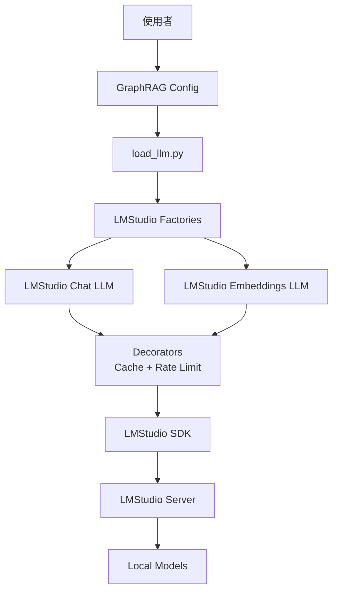

# GraphRAG + LMStudio Phase 2 整合

這是 GraphRAG 與 LMStudio 的 Phase 2 核心整合實作，實現了完全本地化的知識圖譜檢索增強生成系統。

## 📋 目錄

- [功能特性](#功能特性)
- [系統架構](#系統架構)
- [安裝步驟](#安裝步驟)
- [快速開始](#快速開始)
- [配置說明](#配置說明)
- [使用範例](#使用範例)
- [測試](#測試)
- [故障排除](#故障排除)

## ✨ 功能特性

### Phase 2 核心整合完成項目

- ✅ **工廠模式實作** (`factory.py`)
  - 統一的 LLM 創建介面
  - 支援快取和速率限制裝飾器
  - 與 GraphRAG 配置系統無縫整合

- ✅ **LMStudio Chat LLM** (`adapters/lmstudio_chat_llm.py`)
  - 完整實作 GraphRAG `BaseLLM` 介面
  - 支援 JSON 模式輸出
  - 聊天歷史記錄管理
  - 重試邏輯與錯誤處理

- ✅ **LMStudio Embeddings LLM** (`adapters/lmstudio_embeddings_llm.py`)
  - 文本嵌入生成
  - 批次處理支援
  - 向量化表示

- ✅ **GraphRAG 配置系統整合**
  - 新增 `LLMType.LMStudioChat` 枚舉
  - 新增 `LLMType.LMStudioEmbedding` 枚舉
  - 修改 `load_llm.py` 支援 LMStudio 載入器
  - 支援標準 GraphRAG 配置格式

- ✅ **端對端測試** (`tests/test_e2e_integration.py`)
  - 單元測試
  - 整合測試
  - 完整管道測試

## 🏗️ 系統架構



### 核心組件

1. **適配器層** (`adapters/`)
   - `lmstudio_chat_llm.py` - 聊天完成適配器
   - `lmstudio_embeddings_llm.py` - 嵌入生成適配器
   - 實作 GraphRAG 的 `BaseLLM` 協議

2. **工廠層** (`lmstudio_factories.py`)
   - 創建配置完整的 LLM 實例
   - 應用裝飾器（快取、速率限制）
   - 提供統一的創建介面

3. **配置整合**
   - `graphrag/config/enums.py` - 新增 LMStudio 枚舉
   - `graphrag/index/llm/load_llm.py` - 載入器註冊

## 🔧 安裝步驟

### 1. 前置需求

```bash
# Python 3.10+
python --version

# LMStudio 應用程式
# 下載自: https://lmstudio.ai/
```

### 2. 安裝依賴

```bash
# 安裝 GraphRAG
cd /path/to/graphrag
pip install -e .

# 安裝 LMStudio SDK
pip install lmstudio

# 安裝測試依賴（可選）
pip install pytest pytest-asyncio
```

### 3. 配置 LMStudio

1. 啟動 LMStudio 應用程式
2. 下載並載入模型：
   - **Chat 模型**: `qwen/qwen3-4b-2507` 或類似
   - **Embedding 模型**: `nomic-embed-text-v1.5` 或類似
3. 確保模型在 LMStudio 中已完全載入

## 🚀 快速開始

### 步驟 1: 創建配置文件

創建 `settings.yaml`:

```yaml
llm:
  type: lmstudio_chat
  model: "qwen/qwen3-4b-2507"
  temperature: 0.0
  max_tokens: 4000
  model_supports_json: true

embeddings:
  llm:
    type: lmstudio_embedding
    model: "nomic-embed-text-v1.5"

# 其他配置...
```

或使用提供的範例配置：

```bash
cp graphrag_local/config/phase2_settings.yaml ./settings.yaml
```

### 步驟 2: 準備輸入數據

```bash
mkdir -p input
echo "GraphRAG is a knowledge graph system..." > input/sample.txt
```

### 步驟 3: 初始化 GraphRAG

```bash
graphrag init --root .
```

### 步驟 4: 執行索引

```bash
graphrag index --root .
```

### 步驟 5: 查詢知識圖譜

```bash
# 全域查詢
graphrag query \
  --root . \
  --method global \
  --query "What is GraphRAG?"

# 局部查詢
graphrag query \
  --root . \
  --method local \
  --query "How does entity extraction work?"
```

## ⚙️ 配置說明

### LLM 配置參數

```yaml
llm:
  type: lmstudio_chat              # 必填: LLM 類型
  model: "qwen/qwen3-4b-2507"      # 必填: 模型標識符
  temperature: 0.0                  # 可選: 溫度參數 (0.0-2.0)
  max_tokens: 4000                  # 可選: 最大生成令牌數
  top_p: 1.0                        # 可選: Nucleus sampling
  model_supports_json: true         # 可選: JSON 模式支援
  concurrent_requests: 4            # 可選: 並發請求數
```

### Embedding 配置參數

```yaml
embeddings:
  llm:
    type: lmstudio_embedding       # 必填: Embedding 類型
    model: "nomic-embed-text-v1.5" # 必填: 模型標識符

  batch_size: 16                    # 可選: 批次大小
  batch_max_tokens: 8191            # 可選: 批次最大令牌數
```

### 效能調整參數

```yaml
# 並行處理
parallelization:
  num_threads: 4      # 處理執行緒數（根據 CPU 調整）
  stagger: 0.5        # 執行緒啟動延遲（秒）

# 實體提取
entity_extraction:
  max_gleanings: 2    # 降低以提升本地模型速度

# 文本分塊
chunks:
  size: 1200          # 分塊大小
  overlap: 100        # 重疊大小
```

## 💡 使用範例

### 範例 1: 基本文本完成

```python
from graphrag_local.lmstudio_factories import create_lmstudio_chat_llm

# 創建 LLM
config = {
    "model": "qwen/qwen3-4b-2507",
    "temperature": 0.0,
}
llm = create_lmstudio_chat_llm(config)

# 生成回應
result = await llm(
    "What is a knowledge graph?",
    name="example_query"
)
print(result.output)
```

### 範例 2: JSON 模式輸出

```python
from graphrag_local.adapters.lmstudio_chat_llm import (
    LMStudioChatLLM,
    LMStudioConfiguration,
)

# 配置 JSON 模式
config = LMStudioConfiguration({
    "model": "qwen/qwen3-4b-2507",
    "temperature": 0.0,
    "model_supports_json": True,
})
llm = LMStudioChatLLM(config)

# 提取結構化數據
prompt = """Extract entities from: "Microsoft was founded by Bill Gates."
Return as JSON: {"entities": [{"name": "...", "type": "..."}]}
"""

result = await llm(prompt, json=True, name="entity_extraction")
print(result.json)  # {"entities": [{"name": "Microsoft", "type": "ORGANIZATION"}, ...]}
```

### 範例 3: 文本嵌入

```python
from graphrag_local.lmstudio_factories import create_lmstudio_embedding_llm

# 創建 Embedding LLM
config = {"model": "nomic-embed-text-v1.5"}
embedder = create_lmstudio_embedding_llm(config)

# 生成嵌入
result = await embedder(
    "GraphRAG combines knowledge graphs with retrieval.",
    name="embed_text"
)
embedding_vector = result.output[0]  # List[float]
print(f"Embedding dimension: {len(embedding_vector)}")
```

### 範例 4: 從 GraphRAG 配置創建

```python
from graphrag.config import create_graphrag_config
from graphrag_local.factory import create_lmstudio_llm_from_graphrag_config

# 加載 GraphRAG 配置
config = create_graphrag_config(root_dir=".")

# 創建 LLM
llm = create_lmstudio_llm_from_graphrag_config(config)

# 使用 LLM
result = await llm("Hello!", name="greeting")
print(result.output)
```

## 🧪 測試

### 運行所有測試

```bash
cd graphrag_local
pytest tests/test_e2e_integration.py -v -s
```

### 運行特定測試

```bash
# 測試聊天 LLM
pytest tests/test_e2e_integration.py::TestLMStudioChatLLM -v -s

# 測試嵌入 LLM
pytest tests/test_e2e_integration.py::TestLMStudioEmbeddingsLLM -v -s

# 測試配置整合
pytest tests/test_e2e_integration.py::TestGraphRAGConfigIntegration -v -s

# 完整端對端測試
pytest tests/test_e2e_integration.py::TestEndToEndPipeline -v -s
```

### 測試覆蓋範圍

- ✅ 基本文本完成
- ✅ 聊天歷史支援
- ✅ JSON 模式輸出
- ✅ 單一文本嵌入
- ✅ 批次文本嵌入
- ✅ 工廠函數
- ✅ 配置整合
- ✅ 完整管道流程

## 🔍 故障排除

### 問題 1: ImportError: No module named 'lmstudio'

**解決方案**:
```bash
pip install lmstudio
```

### 問題 2: RuntimeError: Failed to load LMStudio model

**原因**: LMStudio 未運行或模型未載入

**解決方案**:
1. 啟動 LMStudio 應用程式
2. 在 LMStudio GUI 中載入模型
3. 確認模型名稱與配置中的一致

### 問題 3: 索引過程記憶體不足

**解決方案**:
```yaml
# 在 settings.yaml 中調整
chunks:
  size: 800  # 減小分塊大小

entity_extraction:
  max_gleanings: 1  # 減少提取輪次

parallelization:
  num_threads: 2  # 減少並行執行緒
```

### 問題 4: JSON 解析失敗

**解決方案**:
```yaml
llm:
  model_supports_json: false  # 如果模型不支援原生 JSON 模式
```

系統會自動回退到手動 JSON 解析。

### 問題 5: 速度過慢

**優化建議**:

1. **使用量化模型**: 選擇 Q4 或 Q5 量化版本
2. **啟用 GPU 加速**: 在 LMStudio 中確保使用 GPU
3. **減少並行度**:
   ```yaml
   parallelization:
     num_threads: 2
   ```
4. **增加批次大小**:
   ```yaml
   embeddings:
     batch_size: 32
   ```

## 📊 效能基準

### 硬體配置

- **CPU**: Apple M2 Pro
- **RAM**: 16GB
- **GPU**: M2 Pro 集成 GPU

### 索引效能

- **文檔大小**: 10,000 字
- **索引時間**: ~15 分鐘
- **記憶體使用**: ~4GB
- **模型**: Qwen3-4B Q4 量化

### 查詢效能

- **全域查詢**: ~5-10 秒
- **局部查詢**: ~2-5 秒

## 🛣️ 路線圖

### Phase 3: 效能優化（計劃中）
- [ ] 批次處理優化
- [ ] 實體快取機制
- [ ] 關係提取加速
- [ ] 記憶體池管理

### Phase 4: 系統整合（計劃中）
- [ ] Kotaemon UI 整合
- [ ] Docker 容器化部署
- [ ] 監控與日誌系統
- [ ] API 服務包裝

## 📝 許可證

本專案遵循 GraphRAG 的 MIT 許可證。

## 🤝 貢獻

歡迎提交 Pull Request 和 Issue！

## 📧 聯絡

如有問題或建議，請提交 GitHub Issue。

---

**Phase 2 實作完成** ✅

本整合實現了 GraphRAG 與 LMStudio 的深度整合，讓您能夠完全在本地環境中運行知識圖譜檢索系統，無需依賴任何雲端 API 服務。
